<div align="center">

# 考心晴 ☀️

### 基于 HarmonyOS NEXT 的「考试焦虑」智能调节助手

把备考压力转化为可执行的小步骤 —— 考试倒计时 / 压力测评 / CBT 认知调节 / 呼吸训练 / 心语陪伴

<br>


<sub>「考心晴」：考前的每一分不安，都被温柔接住 🌱</sub>

</div>

<br>

<p align="center">
  <a href="docs/screenshots/shot-01.jpg">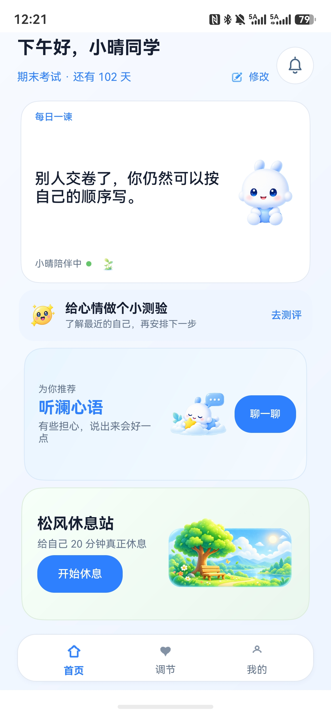</a>
  <a href="docs/screenshots/shot-02.jpg">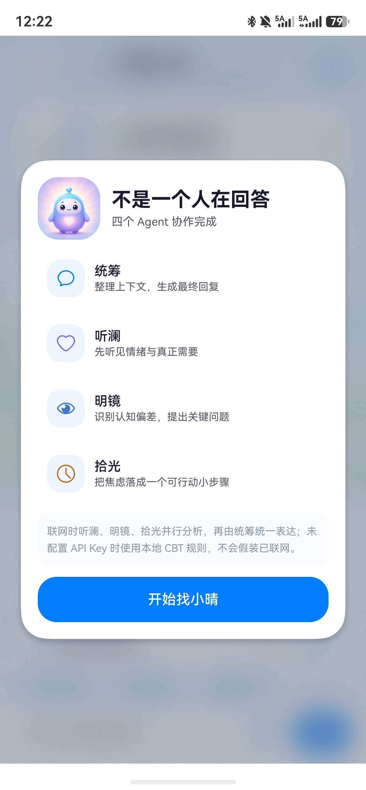</a>
  <a href="docs/screenshots/shot-03.jpg">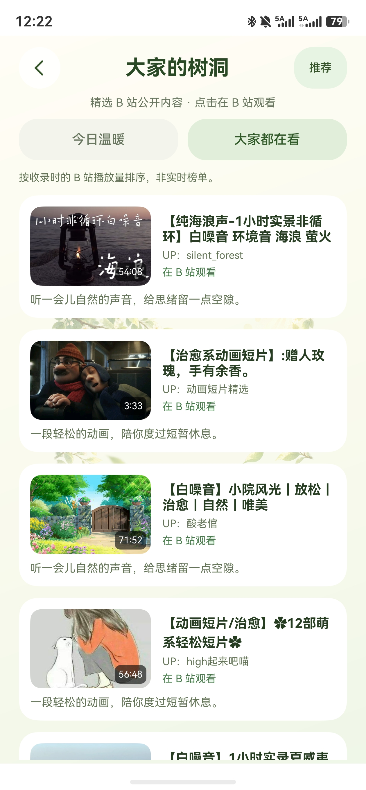</a>
  <a href="docs/screenshots/shot-04.jpg">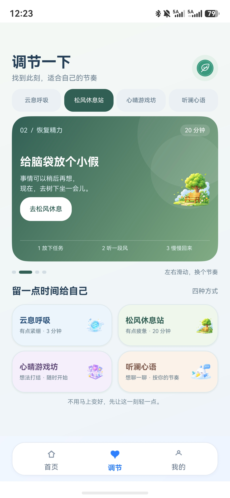</a>
  <a href="docs/screenshots/shot-05.jpg">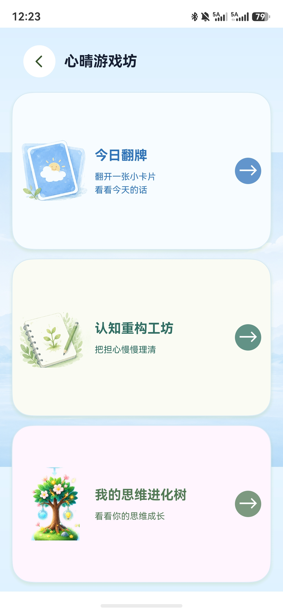</a>
  <a href="docs/screenshots/shot-06.jpg">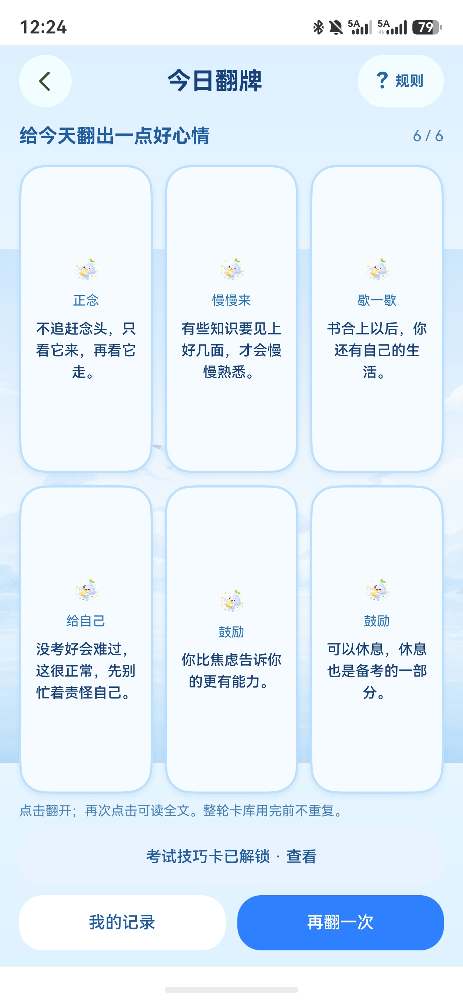</a>
</p>

---

## 📖 项目简介

**考心晴** 是一款面向大学生备考场景的**轻量心理调节工具**（不诊断、不替代咨询）。它不把用户拖进复杂的表格，而是把「焦虑、担心、复习混乱」整理成**五分钟内就能完成的小步骤**。

> 核心链路：**备考规划 → 压力测评 → 认知调节 → 放松训练 → 考后分析**

项目默认采用**隐私优先**：不配置 API Key 时完全本地运行，基于内置 **CBT（认知行为疗法）** 规则库提供引导；配置 DeepSeek API Key 后自动升级为结构化多 Agent 对话。

---

## ✨ 核心功能

| 模块 | 说明 |
| --- | --- |
| 🏠 **智能首页** | 考试倒计时、今日任务、压力指数与计划进度一屏总览，根据压力等级 / 倒计时 / 训练记录生成个性化推荐 |
| 📝 **压力测评** | 自评量表记录压力指数，标准记录不可篡改，全程本地持久化 |
| 🧭 **心理状态** | 每日心情打卡（分数/情绪/影响因素），Canvas 趋势图 + 纯本地 7 天规则洞察；完成呼吸训练后自动写入记录 |
| 💬 **听澜心语** | 轻量多 Agent 陪伴对话：**安全守门 → 听澜（共情）→ 明镜（识别认知偏差）→ 拾光（行动建议）→ 心语总控**，检出高风险表达时直接引导联系真实支持 |
| 🫁 **云息呼吸** | 4-7-8、方块呼吸、快速放松等模式化节奏训练，实况窗持续显示阶段与剩余秒数 |
| 🧠 **认知重构工坊** | 三步挑战识别自动化想法 → 寻找证据 → 建立替代想法，自动沉淀为成长记录 |
| 🎮 **心晴游戏坊** | 今日翻牌、考试技巧卡、思维进化树（记录点亮萌芽→生长→开花），用游戏感完成注意力转移 |
| 🌳 **思维进化树** | 用每一次成长记录点亮一棵自我进化的树 |
| 🍃 **松风休息站** | 树洞分享、白噪音与放松场景，给紧绷的大脑一个暂停 |
| 📊 **我的 · 成长档案** | 心情记录、调节次数、连续陪伴、专注时长、成就徽章 |
| 🎙️ **语音倾诉** | 基于 Core Speech Kit，把口述的担忧直接转成心语教练输入，降低表达门槛 |

---

## 🚀 鸿蒙创新点

- **元服务卡片**：考试倒计时、压力指数、计划完成度无需进入 App 即可查看
- **实况窗（Live View）**：呼吸训练在前台外持续呈现阶段进度
- **分布式数据续接**：同账号两台鸿蒙设备间同步测评进度、压力指数与学习计划
- **小艺意图直达**：支持通过 Want / Intents Kit 一键进入首页、呼吸训练或压力测评
- **双模式 AI**：断网或无密钥时使用本地 CBT 规则，保证核心调节链路永远可用

---

## 🖼️ 界面预览

<p align="center">
  <a href="docs/screenshots/shot-07.jpg">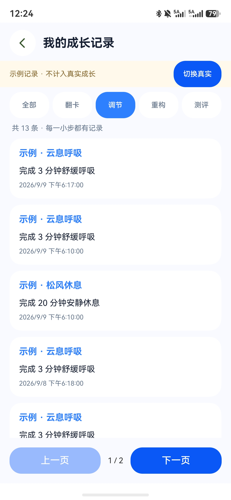</a>
  <a href="docs/screenshots/shot-08.jpg">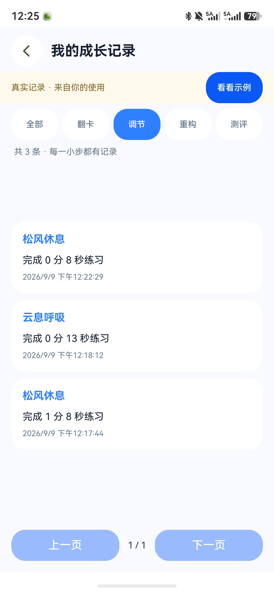</a>
  <a href="docs/screenshots/shot-09.jpg">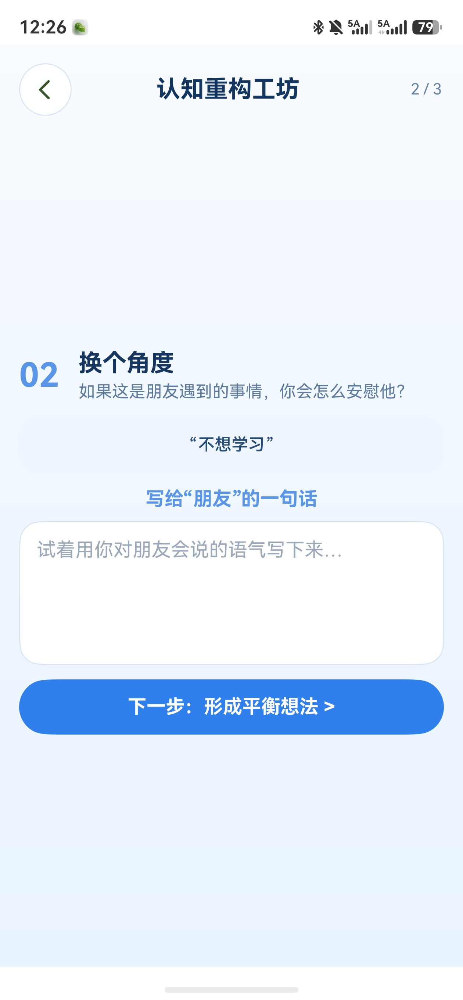</a>
  <a href="docs/screenshots/shot-10.jpg">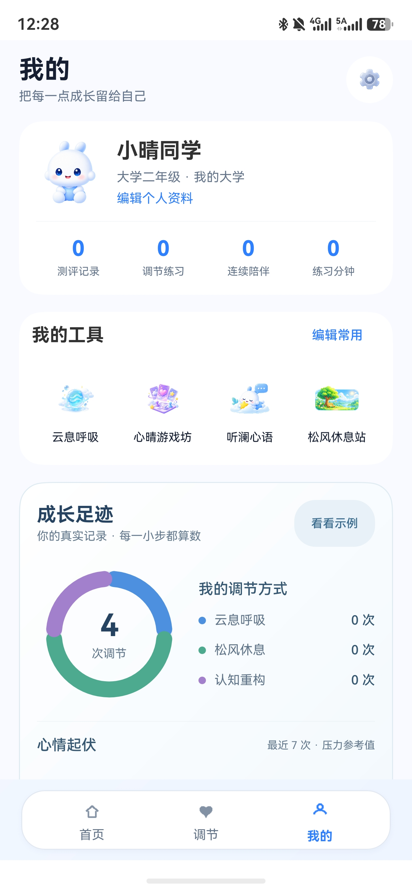</a>
  <a href="docs/screenshots/shot-11.jpg">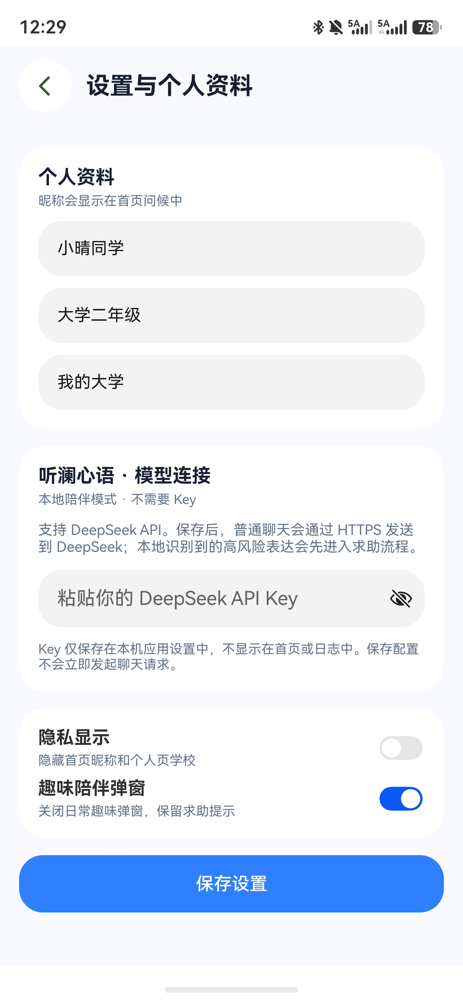</a>
  <a href="docs/screenshots/shot-12.jpg">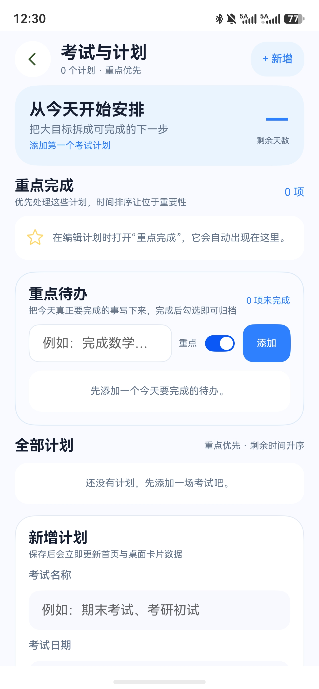</a>
  <a href="docs/screenshots/shot-13.jpg">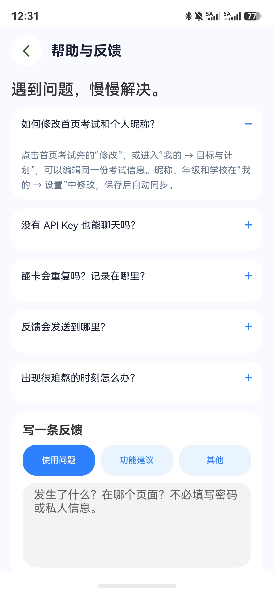</a>
  <a href="docs/screenshots/shot-14.jpg">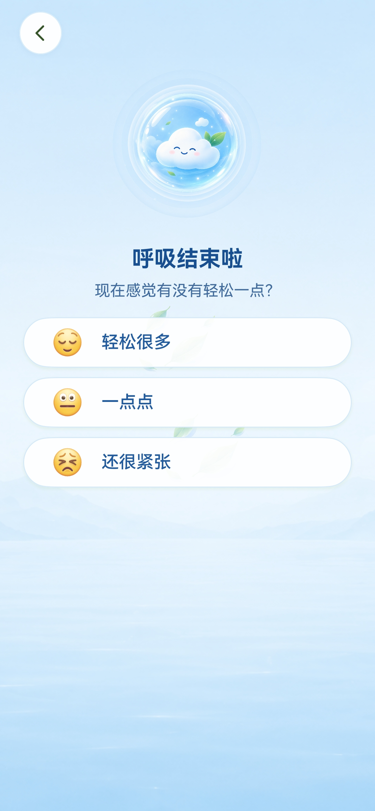</a>
  <a href="docs/screenshots/shot-15.jpg">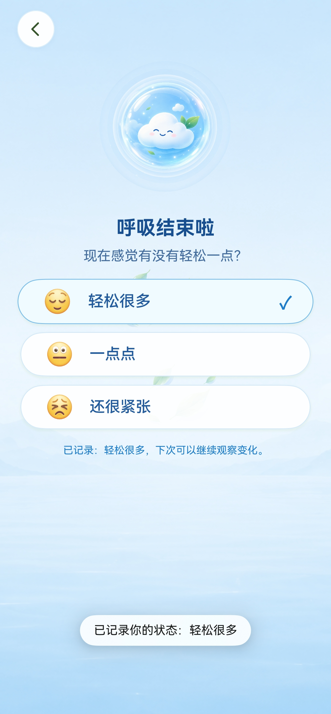</a>
</p>

<details>
<summary>📂 点击展开全部截图（docs/screenshots/）</summary>

| | | |
| --- | --- | --- |
|  |  |  |
|  |  |  |
|  |  |  |
|  |  |  |
|  |  |  |

</details>

---

## 🛠️ 技术栈

- **语言 / 框架**：ArkTS、ArkUI（声明式 UI）
- **系统平台**：HarmonyOS NEXT（SDK API 24），适配手机
- **开发工具**：DevEco Studio 6.1.1+，hvigor 构建
- **网络 AI**：DeepSeek Chat Completions API（可选，默认本地 CBT 模式）
- **系统能力**：元服务卡片 / 实况窗 / 分布式 KV / Core Speech Kit / 小艺意图 / 触觉反馈
- **本地服务**：RelationalStore 持久化（含心理记录表）、Preferences、安全守门、心理健康规则分析、本地兜底回复库

---

## 🚦 快速开始

### 环境要求

| 项目 | 要求 |
| --- | --- |
| 系统 | Windows 10/11 |
| IDE | DevEco Studio 6.1.1 或兼容版本 |
| SDK | HarmonyOS SDK API 24（`6.1.1(24)`） |
| 运行设备 | HarmonyOS NEXT 模拟器 / 已开启开发者模式真机 |

### 在 DevEco Studio 中打开

1. 克隆或下载本项目至**英文路径**，例如 `D:\HarmonyProjects\kaoxinqing-harmonyos-next`
2. DevEco Studio → `Open` → 选择项目根目录
3. 按提示完成 SDK 配置与依赖同步（依赖版本由 `oh-package-lock.json5` 锁定）
4. Device Manager 启动模拟器，或连接真机
5. 点击 `Run`，选择 `entry` 模块运行

> ⚠️ 项目不包含任何私人签名证书。首次安装前请在 DevEco Studio 签名配置界面创建并应用自己的调试签名，**切勿**将证书、私钥或密码提交到公共仓库。

### 命令行构建（可选）

```powershell
$env:DEVECO_SDK_HOME = 'C:\Program Files\Huawei\DevEco Studio\sdk'
& 'C:\Program Files\Huawei\DevEco Studio\tools\hvigor\bin\hvigorw.bat' --mode module -p module=entry@default -p product=default assembleHap
```

未配置签名时会生成 unsigned HAP（仅用于验证构建结果）。

---

## 🗂️ 项目结构

```
kaoxinqing-harmonyos-next
├── AppScope/                     # 应用级配置、图标与全局资源
└── entry/
    └── src/main/
        ├── ets/
        │   ├── entryability/     # 应用入口（含小艺意图 skills）
        │   ├── pages/            # 15+ 页面：首页/调节/我的/测评/呼吸/认知/游戏…
        │   ├── components/       # 底部导航、成长图表、页头等通用组件
        │   ├── services/         # 听澜 Agent、安全守门、心理状态分析、推荐引擎、语音等
        │   ├── widget/           # 元服务压力卡片
        │   └── common/           # 数据模型、UI Tokens、自适应布局
        └── resources/            # 页面资源、rawfile 插图/音效素材
├── docs/screenshots/             # 界面预览截图
├── build-profile.json5           # 工程构建配置
├── oh-package.json5              # 依赖清单
└── hvigorfile.ts                 # hvigor 构建脚本
```

---

## 📄 相关文档

- [HARMONYOS_INTEGRATION.md](./HARMONYOS_INTEGRATION.md) — 鸿蒙能力集成说明
- [BUSINESS_UPGRADE_PLAN.md](./BUSINESS_UPGRADE_PLAN.md) — 产品定位与功能升级路线
- [FUNCTION_AUDIT.md](./FUNCTION_AUDIT.md) — 功能与数据审计

---

## ⚖️ 免责声明

本项目仅用于**考前压力调节与心理教育**，不构成医疗诊断、治疗或咨询建议。若你或身边的人正经历严重心理困扰，请及时联系专业心理健康服务或当地危机干预热线。请优先照顾自己 🌱

## 📜 License

[MIT](./LICENSE)